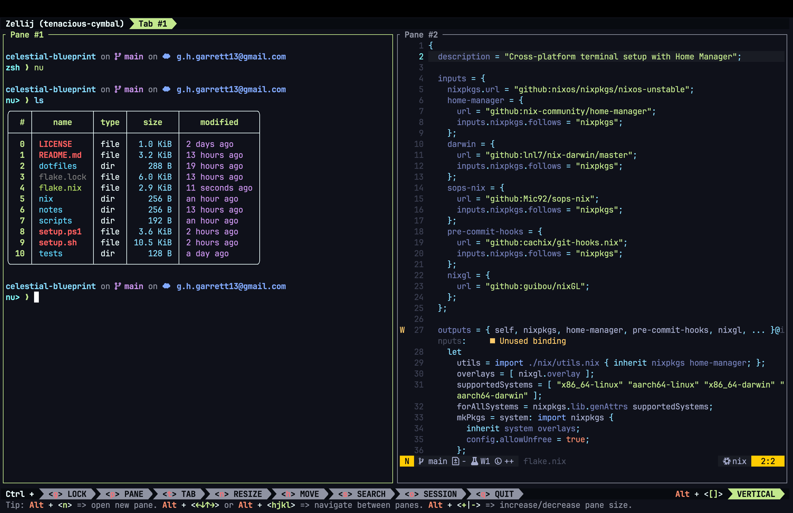

# My Cross-Platform Terminal Setup

A streamlined, one-command setup for a consistent terminal environment with Alacritty, Zellij, and Neovim across
Windows, macOS, and Linux.



## Overview

This repository provides configuration files and setup scripts for a unified terminal experience. It configures:

- [Alacritty](https://github.com/alacritty/alacritty): A fast, cross-platform, OpenGL terminal emulator
- [Zellij](https://github.com/zellij-org/zellij): A terminal workspace (multiplexer) with batteries included
- [Neovim](https://neovim.io/): Hyper-extensible Vim-based text editor


## Features

- Cross-platform compatibility (Windows, macOS, and Linux)
- One-command installation and update process
- Version-controlled configurations
- Easy updates and synchronization across multiple machines
- Automated setup via GitHub Actions

## Prerequisites

- Internet connection
- Administrator/sudo privileges

The setup script will automatically install:

- Git
- Required package manager:
    - `nix`

## Installation

### One-Command Setup

Run the following command in your terminal:

#### On Unix-like systems (Linux and macOS):

```bash
bash <(curl -sL https://raw.githubusercontent.com/geoffreygarrett/celestial-blueprint/main/setup.sh)
```

#### On Windows (in PowerShell):

```powershell
iex ((New-Object System.Net.WebClient).DownloadString('https://raw.githubusercontent.com/geoffreygarrett/celestial-blueprint/main/setup.ps1'))
```

This command will download the setup script, which will then clone the repository, install dependencies, and configure
your terminal environment.

### Manual Setup

1. Clone this repository:
   ```
   git clone https://github.com/geoffreygarrett/celestial-blueprint.git
   ```
2. Navigate to the repository directory:
   ```
   cd celestial-blueprint
   ```
3. Run the setup script:
    - On Unix-like systems: `./setup.sh`
    - On Windows: `.\setup.ps1`

### Update Existing Installation

To update an existing installation, use the `--update` flag:

#### On Unix-like systems (Linux and macOS):

```bash
bash <(curl -sL https://raw.githubusercontent.com/geoffreygarrett/celestial-blueprint/main/setup.sh) --update
```

#### On Windows (in PowerShell):

```powershell
iex ((New-Object System.Net.WebClient).DownloadString('https://raw.githubusercontent.com/geoffreygarrett/celestial-blueprint/main/setup.ps1')) --update
```

## Configuration

### Alacritty

Configuration file: `config/alacritty/alacritty.yml`

### Zellij

Configuration file: `config/zellij/config.kdl`

### Neovim

Configuration file: `config/nvim/init.lua`

Modify these files to customize your setup. After making changes, run the setup script with the `--update` flag to apply
them.

## Contributing

Contributions are welcome! Please feel free to submit a Pull Request.

## License

This project is open source and available under the [MIT License](LICENSE).

## Support

If you encounter any issues or have questions,
please [open an issue](https://github.com/geoffreygarrett/celestial-blueprint/issues) in this repository.

## Continuous Integration

This project uses GitHub Actions for continuous integration. The workflow automatically tests the setup process on
Windows, macOS, and Ubuntu to ensure cross-platform compatibility.

## Nix Naming Conventions

- **File and Directory Names**: kebab-case
    - Example: `home-manager.nix`

- **Package Names**: kebab-case
    - Example: `vscode-with-extensions`

- **Top-level Attribute Names**: kebab-case
    - Example: `build-inputs`

- **Module Names and Options**: camelCase
    - Example: `homeManager`, `extraConfig`

- **Function Names and Arguments**: camelCase
    - Example: `mkDerivation`, `buildInputs`

- **Local Variables**: camelCase
    - Example: `userConfig`

- **Type Names**: PascalCase
    - Example: `String`, `Int`

- **Environment Variables**: UPPER_SNAKE_CASE
    - Example: `NIX_PATH`

**Note**: Maintain consistency within each file or module. When working with existing code, follow the conventions already in use.