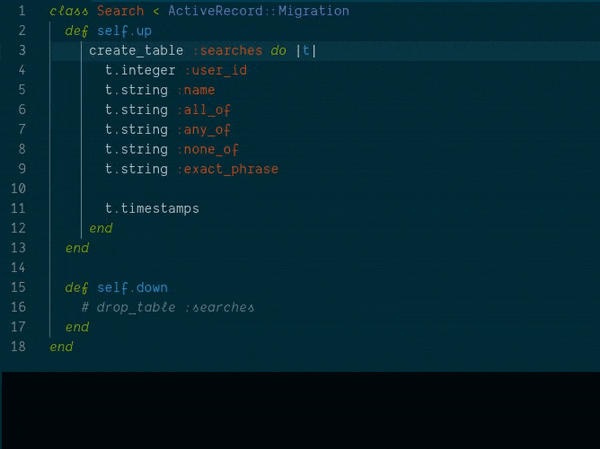
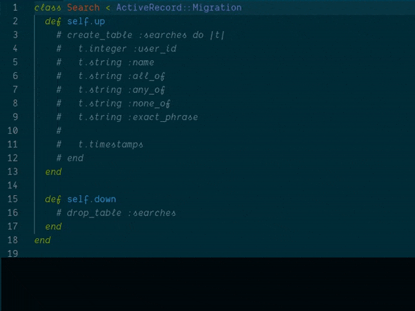

### Vim Notes

#### [Commenting and Uncommenting Blocks of Text](https://stackoverflow.com/questions/1676632/whats-a-quick-way-to-comment-uncomment-lines-in-vim)

- **Comment a Block of Lines:**
  1. Place the cursor on the first line you want to comment.
  1. Press `Ctrl` + `V` to enter
     [**Visual Block** mode](https://vim.fandom.com/wiki/Visual_block_mode).
  1. Use the arrow keys to select down to the last line.
  1. Press `Shift` + `I` to enter **Insert** mode.
  1. Type `#`.
  1. Press `Esc`, wait a second, and the `#` character will be added to all
     selected lines.

- **Uncomment a Block of Lines:**
  1. Place the cursor on the first `#` character.
  1. Press `Ctrl` + `V` to enter
     [**Visual Block** mode](https://vim.fandom.com/wiki/Visual_block_mode).
  1. Use the arrow keys to select all `#` characters vertically across the
     block.
  1. Press `x` to delete all the `#` characters.

**Notes:**

- By default, it's `Ctrl` + `V` to enter Visual Block mode. In gVim on Windows,
  use `Ctrl` + `Q` instead, as `Ctrl` + `V` is used for paste.
